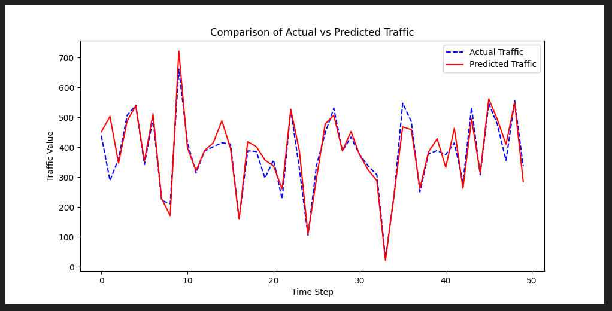

# Spatio-Temporal Fusion Graph Neural Network for Traffic Forecasting


[](https://opensource.org/licenses/MIT)

This repository contains an implementation of the **STFGNN (Spatio-Temporal Fusion Graph Neural Network)** for road traffic flow prediction. The primary goal is to simultaneously model spatial dependencies from the road network structure and temporal dependencies from traffic patterns to achieve higher prediction accuracy.

This project is based on the original paper:
- **Reference Paper:** [Spatio-Temporal Fusion Graph Neural Networks for Traffic Flow Forecasting (AAAI 2022)](https://ojs.aaai.org/index.php/AAAI/article/view/16542)

---

## 🎯 Project Goal

The model takes a series of time-stamped traffic data (e.g., vehicle speed or flow) from multiple sensors across a road network as input. The objective is to accurately predict these same traffic metrics for a future time interval (e.g., the next hour).

---

## 🏗️ Core Idea & Architecture

The STFGNN model addresses the complex dependencies in traffic data through a novel fusion approach:

1.  **Spatial Graph:** A static graph constructed based on the physical proximity and connectivity of sensors in the road network.
2.  **Temporal Graph:** A data-driven graph built using the **Dynamic Time Warping (DTW)** algorithm. This graph connects sensors that exhibit similar traffic patterns over time, even if they are physically distant.
3.  **Graph Fusion:** The model fuses these two graphs into a unified spatio-temporal graph, allowing it to capture both dependencies simultaneously during message passing.

---

## 📂 Project Structure

The repository is organized as follows:

```
├── Codes/
│   ├── Spatial_Matrix.py        # Script to generate the spatial adjacency matrix
│   ├── Temporal_Matrix.py        # Script to generate the temporal (DTW) adjacency matrix
│   └── main.py                     # Main script for training and evaluating the model
├── Matris/
│   └── Spatial_Adjacency_Matrix.csv # The generated spatial matrix
├── Results/
│   └── comparison.jpg              # Chart comparing actual vs. predicted values
├── .gitignore
├── requirements.txt
└── README.md
```

---

## 🛠️ Technologies Used

* **Language:** Python
* **Core Libraries:**
    * MXNet
    * NumPy
    * Pandas
    * Scikit-learn
    * Matplotlib

---

## ⚙️ Setup and Installation

To run this project locally, follow these steps:

1.  **Clone the repository:**
    ```bash
    git clone [https://github.com/your-username/Traffic-Flow-Forecasting-GNN.git](https://github.com/your-username/Traffic-Flow-Forecasting-GNN.git)
    cd Traffic-Flow-Forecasting-GNN
    ```

2.  **Create a virtual environment (recommended):**
    ```bash
    python -m venv venv
    source venv/bin/activate  # On Windows use `venv\Scripts\activate`
    ```

3.  **Install dependencies:**
    ```bash
    pip install -r requirements.txt
    ```

4.  **Prepare the Dataset:**
    This project uses the **PeMS08** dataset. Due to its size, it is not included in this repository. Please download the dataset from a public source and place the `PeMS08.npz` file in the project's root directory.

---

## 🚀 Usage

To run the full pipeline, execute the scripts in the following order:

1.  **Generate Adjacency Matrices:**
    ```bash
    python Codes/Spatial_Matrix.py
    python Codes/Temporal_Matrix.py
    ```
2.  **Train and Evaluate the Model:**
    ```bash
    python Codes/main.py
    ```

---

## 📊 Results

The model was trained for 100 epochs to predict the next hour of traffic (12 time steps) on the PeMS08 test set. The best results achieved are as follows:

| Metric | Value   |
| :----- | :------ |
| MAE    | 23.18   |
| MAPE   | 15.74 % |
| RMSE   | 35.12   |

### Comparison of Actual vs Predicted Traffic



---

## (Challenges)

* **Computational Constraints:** Due to limited time and computational resources, the model was trained for 100 epochs. Further training could potentially yield even lower error metrics and improved performance.

---

## 📄 License

This project is licensed under the MIT License.